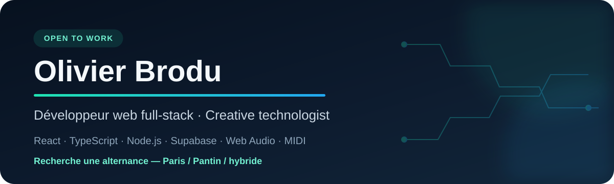
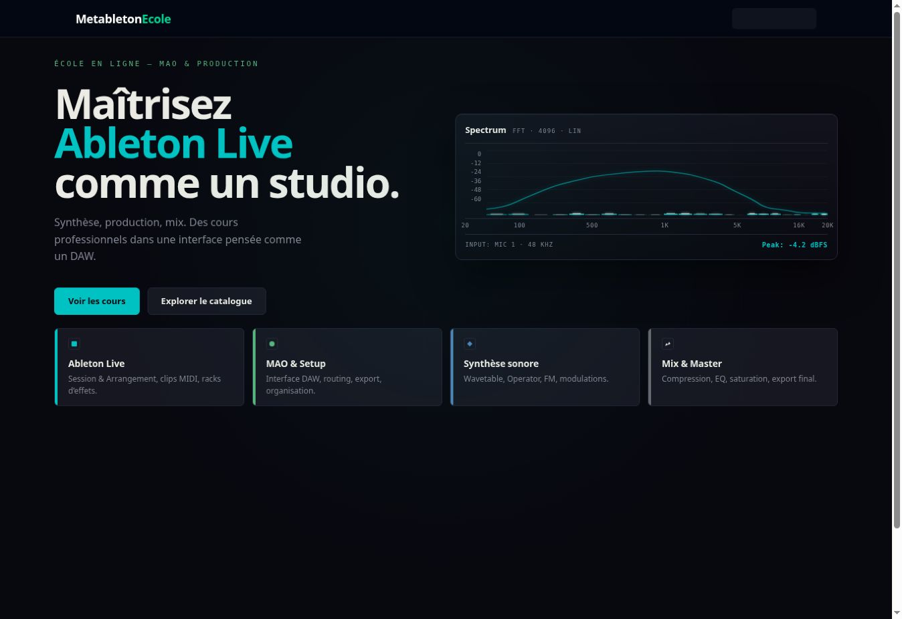
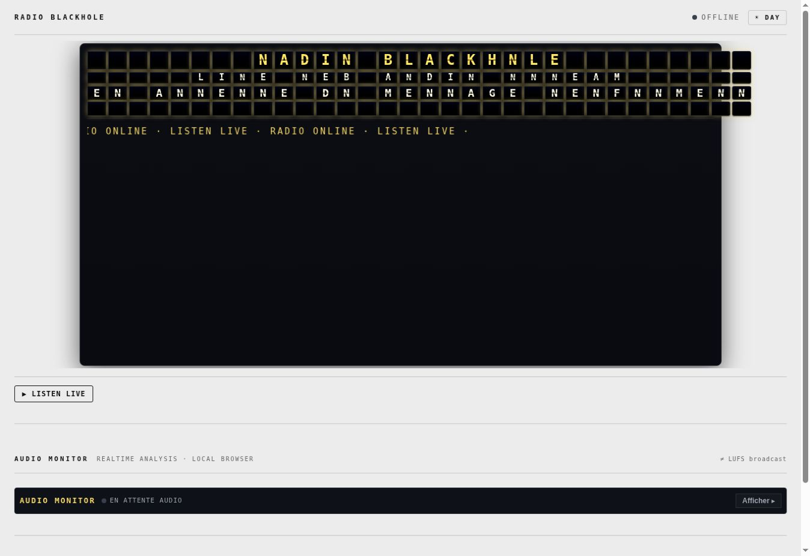
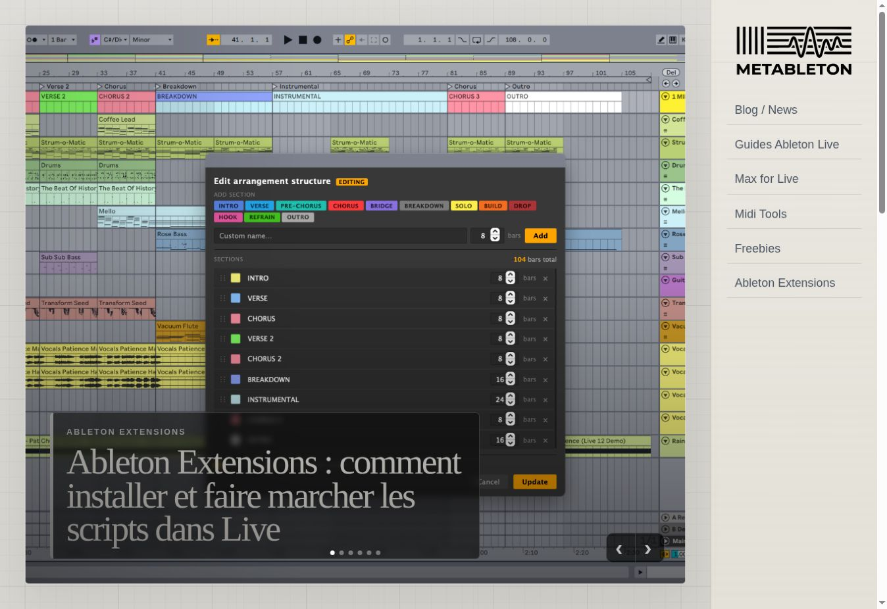
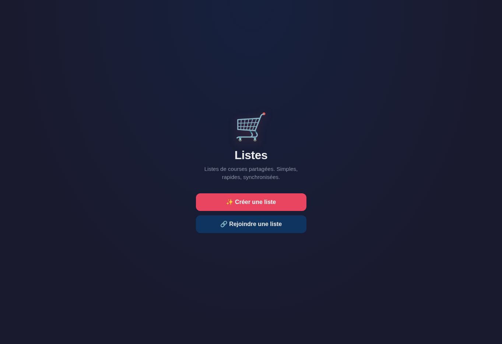
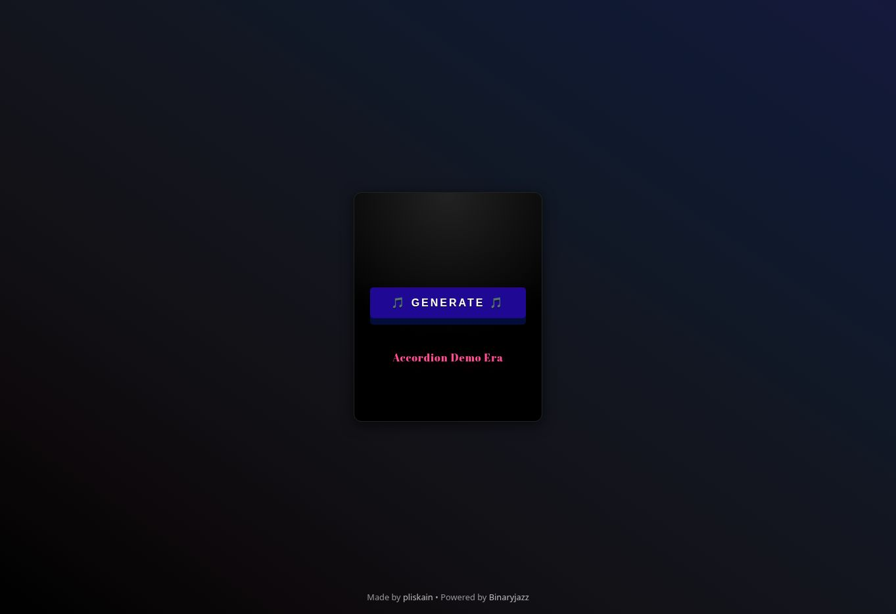

  

  <a href="https://www.linkedin.com/in/olivier-brodu-60370ab7/">LinkedIn</a>
  ·
  <a href="https://github.com/broduoliviercontact-web?tab=repositories">Tous mes dépôts</a>
  ·
  <strong>Disponible pour une alternance</strong>

## Bonjour, moi c'est Olivier 👋

Je suis **développeur web full-stack junior**, formé au **Réacteur**, et je recherche une alternance en Île-de-France.

Avant le développement, j'ai travaillé comme ingénieur du son, musicien et formateur en musique électronique. Aujourd'hui, je transforme cette expérience en produits numériques : applications React, API Node.js, données temps réel, outils Web Audio/MIDI et interfaces reliées à du hardware.

> Mon profil réunit développement web, sens du produit, autonomie et expertise audio — avec une vraie envie d'apprendre au sein d'une équipe.

### Stack principale

`React` · `TypeScript` · `JavaScript` · `Node.js` · `Express` · `Next/Vinext` · `Astro` · `Supabase/PostgreSQL` · `Tailwind CSS` · `Git/GitHub`

### Aussi dans ma boîte à outils

`Web Audio API` · `Web MIDI` · `Socket.IO` · `WebRTC/LiveKit` · `OAuth 2.0` · `REST API` · `Docker` · `PlatformIO/ESP32` · `Max/MSP` · `Ableton Live SDK` · `Godot`

---

## Projets à découvrir

<table>
  <tr>
    <td width="50%" valign="top">
      
      <h3>🧊 Supervie — écran familial connecté</h3>
      
Application de listes partagées pensée pour un écran e-paper tactile fixé sur un réfrigérateur. Synchronisation web/hardware, météo, transports et interface adaptée aux contraintes de l'e-paper.

      
<code>React</code> <code>TypeScript</code> <code>Cloudflare D1</code> <code>ESP32</code> <code>PlatformIO</code>

      
<a href="https://github.com/broduoliviercontact-web/liste-frigo">Code source</a> · <a href="https://liste-frigo.pliskain.chatgpt.site">Démo protégée</a>

    </td>
    <td width="50%" valign="top">
      
      <h3>🎓 Metableton École</h3>
      
Portail d'école de musique en ligne connecté à Google Classroom : authentification Google, rôles élève/professeur/admin, catalogue, inscriptions et base PostgreSQL.

      
<code>React 19</code> <code>Express 5</code> <code>Supabase</code> <code>OAuth 2.0</code> <code>Tailwind</code>

      
<a href="https://github.com/broduoliviercontact-web/metableton-ecole">Code source</a> · <a href="https://metableton-ecole.vercel.app">Voir le site</a>

    </td>
  </tr>
  <tr>
    <td width="50%" valign="top">
      
      <h3>📻 Radio Blackhole</h3>
      
Diffusion live d'une entrée audio Mac vers le web. Espace performer protégé, écoute publique, messages synchronisés et six visualisations audio temps réel dans le navigateur.

      
<code>React</code> <code>TypeScript</code> <code>Express</code> <code>WebRTC</code> <code>LiveKit</code>

      
<a href="https://github.com/broduoliviercontact-web/ableton-blackhole-radio">Code source</a> · <a href="https://ableton-blackhole-radio.vercel.app">Écouter</a>

    </td>
    <td width="50%" valign="top">
      
      <h3>📰 Metableton</h3>
      
Magazine et base de connaissances dédiés à Ableton et à la création musicale. Contenu MDX, taxonomie éditoriale, moteur de recherche, chronologie et back-office.

      
<code>Astro</code> <code>MDX</code> <code>TypeScript</code> <code>Responsive UI</code>

      
<a href="https://github.com/broduoliviercontact-web/metableton-v2">Code source</a> · <a href="https://metableton-v2.vercel.app">Voir le site</a>

    </td>
  </tr>
  <tr>
    <td width="50%" valign="top">
      
      <h3>🛒 Listes Partagées</h3>
      
Listes de courses collaboratives sans inscription : code de partage, sous-listes, suggestions, emojis automatiques et synchronisation instantanée.

      
<code>JavaScript</code> <code>Supabase</code> <code>PostgreSQL</code> <code>Realtime</code> <code>RLS</code>

      
<a href="https://github.com/broduoliviercontact-web/listes-partagees">Code source</a> · <a href="https://vast-maple-qf7x.here.now">Essayer</a>

    </td>
    <td width="50%" valign="top">
      
      <h3>🎲 Genrenator</h3>
      
Expérience générative qui combine une API de genres musicaux avec une collection d'animations, de typographies et de décors CSS aléatoires.

      
<code>React</code> <code>REST API</code> <code>CSS animations</code> <code>Netlify</code>

      
<a href="https://github.com/broduoliviercontact-web/genre-gen">Code source</a> · <a href="https://genrenarator.netlify.app">Essayer</a>

    </td>
  </tr>
  <tr>
    <td width="50%" valign="top">
      
      <h3>🗺️ Ableton Session Mapper</h3>
      
Extension qui analyse un Live Set et l'exporte en JSON, rapports HTML et cartes visuelles. Une passerelle complète entre SDK, modèle de données et visualisation.

      
<code>TypeScript</code> <code>Node.js</code> <code>Ableton SDK</code> <code>Mermaid</code>

      
<a href="https://github.com/broduoliviercontact-web/ableton-scripte-arborescence">Voir le projet</a>

    </td>
    <td width="50%" valign="top">
      
      <h3>🤖 CCB Template</h3>
      
CLI et template pour initialiser des projets assistés par plusieurs agents IA, avec rôles, mémoire durable, validation, documentation et suivi de consommation.

      
<code>Shell</code> <code>Python</code> <code>CLI</code> <code>CI GitHub</code> <code>Documentation</code>

      
<a href="https://github.com/broduoliviercontact-web/CCB-TEMPLATE">Voir le projet</a>

    </td>
  </tr>
</table>

---

## Tous mes projets

### Applications web & produits full-stack

- [FM Live Wire](https://github.com/broduoliviercontact-web/FM-Live-Wire) — transmission MIDI temps réel performer → auditeurs avec Socket.IO et synthèse FM locale.
- [Metableton École](https://github.com/broduoliviercontact-web/metableton-ecole) — plateforme pédagogique React/Express/Supabase/Google Classroom.
- [Metableton V2](https://github.com/broduoliviercontact-web/metableton-v2) et [Metableton V1](https://github.com/broduoliviercontact-web/metableton) — média et ressources autour de la production musicale.
- [Radio Blackhole](https://github.com/broduoliviercontact-web/ableton-blackhole-radio) — broadcast WebRTC et visualisations audio temps réel.
- [Supervie](https://github.com/broduoliviercontact-web/liste-frigo) et [Listes Partagées](https://github.com/broduoliviercontact-web/listes-partagees) — deux approches d'une application familiale synchronisée.
- [Collab Hub Web Monitor](https://github.com/broduoliviercontact-web/collab-hub-web-monitor) et [CH Web Monitor Spike](https://github.com/broduoliviercontact-web/ch-web-monitor-spike) — exploration d'un moniteur de collaboration web.

### Audio, MIDI & outils créatifs

- [Ableton Session Mapper](https://github.com/broduoliviercontact-web/ableton-scripte-arborescence) — cartographie et visualisation de sessions Ableton Live.
- [MIDI SNIFF](https://github.com/broduoliviercontact-web/MIDI-SNIFF) — capture MIDI, création de profils et génération de Remote Scripts Ableton.
- [M4L Remote Mapper](https://github.com/broduoliviercontact-web/m4l-remote-mapper) et [Ableton Device Mapper](https://github.com/broduoliviercontact-web/ableton-device-mapper) — outils de mapping de contrôleurs et devices.
- [BMAD Max/RNBO](https://github.com/broduoliviercontact-web/bmad-max-rnbo) — workflow de conception pour Max et RNBO.
- [Weather → OSC → Max](https://github.com/broduoliviercontact-web/WEATHER_TEST_MAX_OSC) — transformation de données météo en contrôle musical.
- [UVG DM Screen](https://github.com/broduoliviercontact-web/uvg-dm-screen) — interface web dédiée à un dispositif musical.
- [Jazz Digitizer](https://github.com/broduoliviercontact-web/jazz-digitizer) et [Niven Jazz](https://github.com/broduoliviercontact-web/Niven-Jazz) — automatisation de la numérisation et du traitement d'archives sur cassette.

### Écosystème Schwung — générateurs MIDI en C

- [Grilles Topographic Generator](https://github.com/broduoliviercontact-web/Schwung-Midi-Fx-Grilles-topographic-generator)
- [Branchages Multi-Random](https://github.com/broduoliviercontact-web/Schwung-Midi-Fx-branchages-Multi-Random-generator)
- [Marbles for Move](https://github.com/broduoliviercontact-web/Schwung-Midi-Fx-marbles-for-move)
- [Brindille Bernoulli Gate](https://github.com/broduoliviercontact-web/Schwung-Midi-Fx-Brindille-Bernouli-Gate)
- [nRettap Euclidean Melody](https://github.com/broduoliviercontact-web/Schwung-Midi-Fx-nRettap-Euclidean-melody-generator)
- [MarkovGroove](https://github.com/broduoliviercontact-web/Schwung-Midi-Fx-MarkovGroove-A-Tiny-Markov-Engine)
- [Sting64](https://github.com/broduoliviercontact-web/Schwung-Midi-Fx-Sting64-Acid-inspired-generative)
- [Acid Gen](https://github.com/broduoliviercontact-web/Schwung-Midi-Fx-Acid-Gen-Acid-Pattern-Generator)
- [DOOM for Schwung](https://github.com/broduoliviercontact-web/DOOM-FOR-SCHWUNG)
- [Skills Schwung](https://github.com/broduoliviercontact-web/SKILLS-SCHWUNG-MIDI-FX) et [skill Codex](https://github.com/broduoliviercontact-web/codex-skill-for-midi-fx-schwung) — documentation et automatisation du workflow.

### Interfaces, données & projets pédagogiques

- [Marvel Pokédex](https://github.com/broduoliviercontact-web/marvel-pokedex), [API Marvel](https://github.com/broduoliviercontact-web/backend-marvel) et [Pokédex V1](https://github.com/broduoliviercontact-web/Pokedex_V1) — consommation d'API, recherche, favoris et UI responsive.
- [Aria Front](https://github.com/broduoliviercontact-web/test-aria) et [Aria Back](https://github.com/broduoliviercontact-web/aria-back) — fiches de personnages et outils pour jeu de rôle.
- [Genrenator](https://github.com/broduoliviercontact-web/genre-gen) — générateur musical et laboratoire d'animations CSS.
- [Météo News](https://github.com/broduoliviercontact-web/meteo-news) — agrégateur RSS présenté comme un bandeau d'information.
- [Todo Vacances](https://github.com/broduoliviercontact-web/todo-vacances) — checklist interactive pour préparer un départ.

### Visualisations & expérimentations

- Série Split-Flap : [Counter](https://github.com/broduoliviercontact-web/split-flap-counter), [Guns](https://github.com/broduoliviercontact-web/split-flap-guns), [Hunger](https://github.com/broduoliviercontact-web/split-flap-hunger), [Minors](https://github.com/broduoliviercontact-web/split-flap-minors), [Police](https://github.com/broduoliviercontact-web/split-flap-police), [Demo](https://github.com/broduoliviercontact-web/split-flap-demo) et [Template](https://github.com/broduoliviercontact-web/flip-flap-template).
- [Backline Hero](https://github.com/broduoliviercontact-web/backlin-hero) — prototype Godot inspiré d'Overcooked autour de la logistique de concert.
- [CCB Template](https://github.com/broduoliviercontact-web/CCB-TEMPLATE) et [Genre Token Test](https://github.com/broduoliviercontact-web/genre-token-test) — expérimentation autour des workflows IA et de l'optimisation de contexte.
- [Synthpedia](https://github.com/broduoliviercontact-web/Synthpedia) — encyclopédie et frise chronologique des synthétiseurs, **en construction**.

---

## Ce que je peux apporter à une équipe

- Une pratique concrète du **front et du back**, de la maquette au déploiement.
- L'habitude de construire des projets complets : authentification, API, base de données, temps réel, tests et documentation.
- Une culture de l'interface issue de la musique : écoute, itération, contraintes de performance et attention portée à l'expérience utilisateur.
- Un regard transversal capable de relier **logiciel, audio, données et objets physiques**.

## Ce que je recherche

Une **alternance en développement web full-stack**, à Paris, Pantin ou en mode hybride, dans une équipe où je pourrai consolider mes bases, contribuer à de vrais produits et continuer à progresser.

  <a href="https://www.linkedin.com/in/olivier-brodu-60370ab7/"><strong>Me contacter sur LinkedIn</strong></a>

